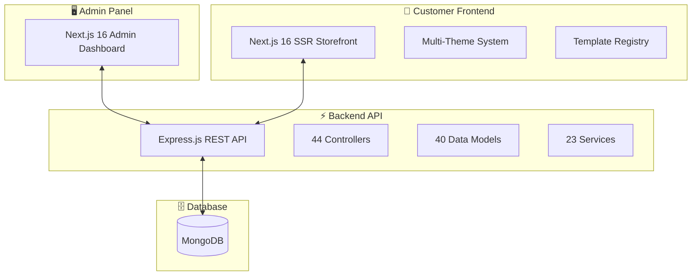
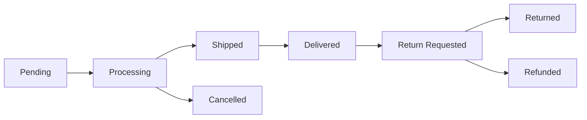

# 🚀 Infi Commerce — The Ultimate Next.js E-commerce CMS Platform

> **Industry's First Enterprise-Grade, Multi-Store E-commerce Solution Built on Next.js 16 & React 19**

---

## 🏆 Why Infi Commerce is the Best CMS in the Market

Infi Commerce isn't just another e-commerce platform — it's a **complete digital commerce ecosystem** designed from the ground up with **cutting-edge technology**, **unmatched flexibility**, and **enterprise-level performance**. Built on the powerful combination of **Next.js 16**, **React 19**, and **Node.js**, this platform delivers the **fastest**, **most customizable**, and **most developer-friendly** e-commerce experience available today.

---

# 📊 Platform Overview



---

# 🏪 MULTI-STORE ARCHITECTURE
## Industry's First True Multi-Tenant Next.js Commerce Platform

> [!IMPORTANT]
> **Revolutionary Multi-Store System** — Run unlimited stores from a single installation with complete data isolation, unique domains, and independent configurations.

### ✨ Key Capabilities

| Feature | Description |
|---------|-------------|
| **🌐 Domain Routing** | Automatic subdomain-based store detection with custom domain support |
| **🔒 Complete Isolation** | Each store has isolated products, orders, customers, and settings |
| **💰 Multi-Currency** | Per-store currency configuration with real-time exchange rates |
| **🕐 Timezone Support** | Store-specific timezone for accurate order timestamps |
| **🎨 Independent Branding** | Unique logos, favicons, and theme per store |
| **📧 Separate Notifications** | Store-specific email/SMS/WhatsApp settings |

### Store Configuration Options

```
✅ Custom Domain & Subdomain Routing
✅ Store-Specific SEO (Meta Title, Description, OG Images)
✅ Independent Payment Gateway Configuration
✅ Per-Store Google Analytics & Social Login
✅ Maintenance Mode Toggle
✅ Guest Checkout Controls
✅ Email Verification Requirements
✅ Min/Max Order Amount Limits
```

---

# 🎯 VISUAL LAYOUT BUILDER
## Drag-and-Drop Page Builder — No Code Required!

> [!TIP]
> **Build Stunning Pages in Minutes** — Our revolutionary Layout Builder gives you complete control over every page without writing a single line of code.

### 🎨 Supported Page Types

| Page Type | Description |
|-----------|-------------|
| **Homepage** | Create stunning landing pages with unlimited sections |
| **Category** | Custom layouts per category with slug-specific designs |
| **Product** | Flexible product detail page arrangements |
| **Search** | Customize search result presentations |
| **Blog List** | Beautiful blog listing layouts |
| **Blog Post** | Rich blog post templates |
| **Static Pages** | About, Contact, FAQ, and custom pages |
| **Cart** | Shopping cart page layouts |
| **Checkout** | Streamlined checkout experiences |
| **Account** | Customer dashboard layouts |

### 📦 30+ Built-in Modules

````carousel
**Content Modules**
- 🖼️ Banner (Hero images with CTAs)
- 🎠 Banner Slider (Animated carousels)
- 📝 Text Block (Rich text content)
- 🖼️ Image & Image Gallery
- 🎥 Video (YouTube, Vimeo, Custom)
- ⏱️ Countdown Timer
- 📜 HTML Block (Custom code)
- ➖ Spacer & Divider
<!-- slide -->
**E-commerce Modules**
- 🛍️ Product Carousel (Sliding products)
- 📦 Product Grid (Configurable columns)
- 🌟 Featured Product (Spotlight single product)
- 📂 Category Showcase
- 📑 Category Header (Dynamic per category)
- 🔍 Search Results Module
- 🛒 Cart Module
- 💳 Checkout Module
<!-- slide -->
**Marketing Modules**
- 📧 Newsletter Signup
- ⭐ Testimonials
- 🏷️ Brand Logos
- 💬 Social Icons
- 📊 Google Analytics Integration
- 📢 Promotional Banners
````

### 🔧 Advanced Layout Features

```
Section Types:
├── Full-Width (Edge-to-edge content)
├── Container (Centered with max-width)
├── Split-2 (Two-column layouts)
├── Split-3 (Three-column layouts)
├── Split-4 (Four-column layouts)
└── Custom (Fully customizable)

Module Settings:
├── Per-Device Visibility (Desktop/Tablet/Mobile)
├── Custom CSS Classes
├── Margin & Padding Controls
├── Background Colors & Images
├── Custom JavaScript Injection
└── SEO Metadata per Layout
```

---

# 🛍️ PRODUCT MANAGEMENT
## Enterprise-Grade Catalog System

> [!IMPORTANT]
> **The Most Comprehensive Product System** — Support for Simple, Variable, and Digital products with advanced inventory, pricing, and geo-restrictions.

### 📦 Product Types

| Type | Features |
|------|----------|
| **Simple** | Single product with one price and SKU |
| **Variable** | Multiple variants with different prices, images, and stock |
| **Digital** | Downloadable products with access controls |

### 🌟 Advanced Product Features

````carousel
**Pricing & Inventory**
- 💵 Regular & Sale Pricing
- 📅 Scheduled Sale Dates (Auto start/end)
- 💰 Cost Price Tracking (Profit margins)
- 📊 Stock Management with Low Threshold Alerts
- 🏷️ Stock Status: In Stock, Out of Stock, Backorder, Made-to-Order
- 📦 Weight & Dimensions for Shipping
<!-- slide -->
**Variant System**
- 🎨 Unlimited Attributes per Product
- 🔗 Linked Product Options
- 🖼️ Per-Variant Images
- 💲 Per-Variant Pricing & Sale Prices
- 📊 Per-Variant Stock Levels
- 📐 Per-Variant Weight & Dimensions
<!-- slide -->
**Digital Products**
- 📁 Multiple Download Files per Product
- 🔢 Download Limit Controls
- ⏳ Download Expiry (Days after purchase)
- 🔒 Secure File Delivery
- 📊 Download Count Tracking
<!-- slide -->
**Geo-Restriction**
- 🌍 Country-Level Restrictions
- 🗺️ State/Province-Level Restrictions
- 🏙️ City-Level Restrictions
- ✅ Auto-hide products based on customer location
````

### 📸 Media Management

```
✅ Multiple Product Images
✅ Featured Image Selection
✅ Video Support (YouTube, Vimeo, Direct URL)
✅ Video Thumbnails
✅ Per-Variant Image Galleries
```

### 🔍 SEO Optimization

```
Auto-Generated Features:
├── Canonical URLs (Based on store domain)
├── Meta Title & Description
├── Focus Keywords
├── Open Graph (og:title, og:description, og:image)
├── Twitter Cards
└── JSON-LD Structured Data
```

---

# 📋 ORDER MANAGEMENT
## Complete Order Lifecycle Control

> [!TIP]
> **Full Order Visibility** — Track every order from creation to delivery with comprehensive status management and customer communication.

### 📊 Order Statuses



### 💳 Payment Gateway Support

| Gateway | Regions | Features |
|---------|---------|----------|
| **Razorpay** | India | UPI, Cards, Netbanking, Wallets |
| **Stripe** | Global | Cards, Apple Pay, Google Pay |
| **PayPal** | Global | PayPal Balance, Cards |
| **COD** | Configurable | Cash on Delivery |

### 🔄 Refund & Return System

```
✅ Customer Return Requests
✅ Admin Approval Workflow
✅ Refund Status Tracking (Requested → Approved → Processed)
✅ Refund Reason Documentation
✅ Automatic Payment Refunds (Razorpay, Stripe, PayPal)
```

### 📦 Shipping & Tracking

```
✅ Courier Name Configuration
✅ Tracking Number Entry
✅ Tracking URL Support
✅ Shipped & Delivered Timestamps
✅ Customer Email Notifications
```

### 📝 Order Notes

```
✅ Customer Notes (During checkout)
✅ Admin Notes (Internal use)
✅ Tax Breakdown with Split Tax Support
✅ Currency & Exchange Rate at Order Time
```

---

# 🚚 ADVANCED SHIPPING SYSTEM
## Intelligent Shipping Calculator

> [!IMPORTANT]
> **Most Flexible Shipping Rules** — Create complex shipping scenarios with geo-groups, weight-based pricing, and category restrictions.

### 📍 Geo-Group System

```
Create Reusable Location Groups:
├── Country Groups (e.g., "ASEAN Countries", "EU Zone")
├── State/Region Groups
├── City Groups
└── Custom Mixed Groups
```

### 📊 Shipping Rule Types

| Rate Type | Description |
|-----------|-------------|
| **Flat Rate** | Fixed shipping cost |
| **Per KG** | Weight-based pricing |
| **Free Shipping** | No shipping cost |
| **Percentage** | Percentage of order value |

### 🔧 Condition Matrix

```
Shipping Conditions:
├── 📍 Geo-Group Matching
├── 📦 Min/Max Weight Ranges
├── 💰 Min/Max Order Value
├── 📂 Category-Specific Rules
├── 🔢 Priority Ordering
└── ⏱️ Estimated Delivery Days
```

---

# 💰 COUPON & PROMOTION ENGINE
## Enterprise Discount Management

### 🎟️ Coupon Types

| Type | Description |
|------|-------------|
| **Flat Discount** | Fixed amount off |
| **Percentage** | Percentage discount with cap |

### 🔒 Usage Controls

```
Advanced Limits:
├── 🔢 Total Usage Limit
├── 👤 Per-Customer Limit
├── 💰 Minimum Cart Value
├── 🎯 Maximum Discount Cap
├── 📅 Start & End Dates
└── 📂 Category Restriction (Store-wide or specific categories)
```

### 📊 Analytics

```
✅ Usage Count Tracking
✅ Per-Customer Usage History
✅ Validity Checks (Auto-disable expired coupons)
```

---

# 📧 NOTIFICATION ENGINE
## Industry's Most Comprehensive Multi-Channel Notification System

> [!IMPORTANT]
> **5+ Email Providers • 3+ SMS Providers • 2+ WhatsApp Providers**  
> The most flexible notification system in any e-commerce platform!

### 📨 Email Providers

| Provider | Type | Features |
|----------|------|----------|
| **SMTP** | Universal | Any SMTP server |
| **Amazon SES** | Cloud | High deliverability |
| **SendGrid** | API | Advanced analytics |
| **Mailjet** | API | Transactional & Marketing |

### 📱 SMS Providers

| Provider | Regions | Features |
|----------|---------|----------|
| **Twilio** | Global | Reliable delivery |
| **MSG91** | India Focus | Templates support |
| **D7Networks** | Global | Competitive pricing |

### 💬 WhatsApp Providers

| Provider | Type | Features |
|----------|------|----------|
| **Meta (Official)** | Business API | Templates, Rich media |
| **Twilio** | Business API | Easy integration |
| **D7Networks** | Business API | Multi-region |

### 🔔 Telegram Support

```
Admin Notifications via Telegram:
├── New Order Alerts
├── Order Status Changes
├── Return Requests
├── Order Cancellations
└── New Customer Registrations
```

### 📋 Notification Types

````carousel
**Customer Notifications**
- 📧 Welcome Email
- ✅ Email Verification
- 🔐 Password Reset
- 📦 Order Confirmation
- 🚚 Shipping Update
- 📬 Delivery Confirmation
- 💳 Payment Confirmation
- 🔄 Refund Notification
<!-- slide -->
**Admin Notifications**
- 🆕 New Order Alert
- 📊 Order Status Change
- 🔄 Return Request
- ❌ Order Cancellation
- 👤 New Customer Registration
- 📉 Low Stock Alert
````

### ⚙️ Template System

```
✅ Handlebars Template Engine
✅ Store-Specific Templates
✅ Default Fallback Templates
✅ Rich HTML Email Support
✅ Variable Substitution (Customer name, Order details, etc.)
```

### 📊 Queue-Based Processing

```
Priority Levels:
├── 🔴 Critical (Immediate)
├── 🟠 High Priority
├── 🟡 Normal
└── 🟢 Low Priority

Features:
├── Retry Logic with Exponential Backoff
├── Failure Tracking
├── Scheduled Notifications
└── Rate Limiting per Provider
```

---

# 📝 FORM BUILDER
## Create Dynamic Forms Without Code

> [!TIP]
> **Build Any Form** — Contact forms, surveys, lead capture, quotation requests — all with our visual form builder!

### 📋 Field Types

| Type | Description |
|------|-------------|
| **Text** | Single-line input |
| **Textarea** | Multi-line text |
| **Email** | Email with validation |
| **Phone** | Phone number input |
| **Date/Time** | Date, time, or datetime pickers |
| **Select** | Dropdown selection |
| **Radio** | Single choice buttons |
| **Checkbox** | Multiple selections |
| **File** | File upload |
| **Image** | Image upload |
| **Rich Text** | WYSIWYG editor |
| **Repeater** | Repeatable field groups |

### 🔧 Advanced Features

```
Conditional Logic:
├── Show/Hide based on other field values
├── Operators: equals, not_equals, contains, greater_than, less_than
└── Multiple conditions per field

Validation Rules:
├── Required fields
├── Min/Max length
├── Regex patterns
├── File type restrictions
├── Max file size limits
└── Min/Max numeric values

Layout Options:
├── Full-width sections
├── Split columns (2, 3, 4)
├── Field width percentage
└── Custom CSS classes
```

### 📧 Email Notifications

```
Submission Actions:
├── Admin Email (To, CC, BCC)
├── Custom Subject & Body
├── Reply-To configuration
└── Confirmation Email to Submitter
```

---

# 🎨 THEME SYSTEM
## Visual Theming Made Easy

### 🎭 Built-in Themes

| Theme | Style |
|-------|-------|
| **Modern Clean** | Sleek, minimalist design |
| **Classic Elegance** | Sophisticated, refined look |
| **Core** | Fallback base theme |

### 🔧 Theme Customization

````carousel
**Color System**
- Primary Color
- Secondary Color
- Accent Color
- Background & Surface Colors
- Text & Text Secondary Colors
- Border Color
- Error, Success, Warning Colors
<!-- slide -->
**Typography**
- Heading Font Family
- Body Font Family
- Heading Font Weight
- Body Font Weight
- Google Fonts Integration
<!-- slide -->
**Layout Settings**
- Container Max Width
- Border Radius (none, sm, md, lg, full)
- Spacing (compact, normal, relaxed)
- Button Styles (filled, outline, ghost)
````

### 🔌 Module Support

```
30+ Supported Modules:
├── banner, banner-slider, text-block
├── image, image-gallery, video
├── spacer, divider, html, newsletter
├── testimonials, countdown, brand-logos
├── product-carousel, product-grid
├── category-showcase, featured-product
├── category-header, category-products
├── product-details, search-results
├── blog-listing, blog-content
├── menu, logo, search-bar
├── cart-icon, account-icon
└── social-icons
```

---

# 🔐 SECURITY & ACCESS CONTROL
## Enterprise-Grade Security

### 👥 User Roles

| Role | Access |
|------|--------|
| **Super Admin** | Full system access |
| **Admin** | Store-specific access |
| **Store Admin** | Limited to assigned stores |

### 🔑 Two-Factor Authentication

```
✅ TOTP (Authenticator Apps)
✅ Backup Codes
✅ Per-User 2FA Toggle
✅ Secure Secret Storage
```

### 🔑 API Key Management

> [!IMPORTANT]
> **Most Advanced API Access Control** — Granular permissions, IP whitelisting, rate limiting, and store-scoped access.

```
API Key Features:
├── Channel Types (Web, Mobile, Third Party, Internal)
├── IP Address Whitelisting
├── Validity Date Range
├── Rate Limiting (Requests per minute)
├── Method Permissions (GET, POST, PUT, DELETE, PATCH)
├── Store Scope (All stores or Single store)
├── Usage Tracking & Statistics
└── Secure Key Hashing (SHA-256)
```

---

# 💾 BACKUP & RESTORE
## Enterprise Data Protection

### 📦 Backup System

```
Supported Entities:
├── Products (with variants & options)
├── Categories (hierarchical)
├── Orders (with items & addresses)
├── Customers (with addresses)
├── Brands
├── Coupons
└── And more...

Export Formats:
├── JSON
├── Excel (with styled formatting)
└── MongoDB Native
```

### 🔄 Restore Features

```
✅ Store-Specific Filtering
✅ Conflict Resolution
✅ Validation Before Import
✅ Progress Tracking
✅ Error Reporting
```

---

# 📊 ANALYTICS & REPORTING

### 📈 Dashboard Metrics

```
✅ Total Revenue
✅ Order Count
✅ Average Order Value
✅ Customer Growth
✅ Top Products
✅ Revenue by Day/Week/Month
```

### 🔗 Google Analytics 4 Integration

```
✅ Enhanced E-commerce Tracking
✅ Product View Events
✅ Add to Cart Events
✅ Purchase Events
✅ Custom Event Tracking
✅ Page View Tracking
```

---

# 📝 CONTENT MANAGEMENT

### 📰 Blog System

```
Features:
├── Blog Categories (Hierarchical)
├── Blog Posts with Rich Content
├── Featured Images
├── SEO Optimization
├── Schedule Publishing
├── Author Attribution
└── Related Posts
```

### 📄 Static Pages

```
✅ Custom Page Creation
✅ SEO Metadata
✅ Layout Assignment
✅ Slug Management
```

### 🎫 Banner Management

```
✅ Image Banners
✅ Banner Sliders
✅ Click-through URLs
✅ Scheduling
✅ Store-Specific Banners
```

---

# ⭐ CUSTOMER EXPERIENCE

### 💬 Review System

```
Features:
├── Star Ratings (1-5)
├── Written Reviews
├── Image Uploads
├── Admin Moderation
├── Guest Reviews (Optional)
├── Verified Purchase Badge
└── Review Reply
```

### ❤️ Wishlist

```
✅ Add/Remove Products
✅ Move to Cart
✅ Share Wishlist
✅ Stock Alerts
```

### ⚖️ Product Compare

```
✅ Compare Up to 4 Products
✅ Side-by-Side Attributes
✅ Category Requirement (Optional)
✅ Floating Compare Widget
```

### 🔍 Smart Search

```
✅ Full-Text Search
✅ Autocomplete
✅ Search Suggestions
✅ Filter Integration
```

---

# 🔧 DEVELOPER EXPERIENCE

### 🏗️ Architecture

```
Frontend (Next.js 16):
├── App Router with Server Components
├── SSR + ISR for Performance
├── Container/Template Pattern
├── Theme Registry System
└── TypeScript Throughout

Backend (Express.js):
├── RESTful API Design
├── MongoDB with Mongoose
├── JWT Authentication
├── Middleware Pipeline
└── TypeScript Throughout

Admin (Next.js 16):
├── Modern Admin Dashboard
├── Real-time Updates
├── Responsive Design
└── TypeScript Throughout
```

### 📚 API Features

```
✅ 44 Controller Endpoints
✅ Comprehensive Validation
✅ Error Handling
✅ Rate Limiting
✅ API Key Authentication
✅ JWT for Admin/Customer Auth
```

---

# 🚀 PERFORMANCE

### ⚡ Optimizations

```
✅ Server-Side Rendering (SSR)
✅ Incremental Static Regeneration (ISR)
✅ Image Optimization
✅ Code Splitting
✅ Lazy Loading
✅ Database Indexing
✅ Query Optimization
```

### 📊 Performance Metrics

```
✅ First Contentful Paint: < 1.5s
✅ Largest Contentful Paint: < 2.5s
✅ Lighthouse Score: 90+
```

---

# 🎯 WHY CHOOSE INFI COMMERCE?

| Feature | Infi Commerce | Competitors |
|---------|---------------|-------------|
| **Next.js 16 + React 19** | ✅ Latest | ❌ Outdated |
| **True Multi-Store** | ✅ Native | ⚠️ Add-on |
| **Visual Layout Builder** | ✅ 30+ Modules | ⚠️ Limited |
| **Multi-Channel Notifications** | ✅ 10+ Providers | ⚠️ 1-2 Providers |
| **Theme System** | ✅ Full Customization | ⚠️ Basic |
| **API Key Management** | ✅ Enterprise-Grade | ❌ None |
| **Form Builder** | ✅ Conditional Logic | ❌ Basic |
| **SSR Performance** | ✅ Optimized | ⚠️ Variable |
| **Support** | ✅ Direct From Developers | ⚠️ Limited or community based |

---

# 📞 Get Started Today

Infi Commerce is the **future of e-commerce platforms** — combining the power of **Next.js**, the flexibility of a **headless CMS**, and the robustness of an **enterprise commerce solution**.

> [!TIP]
> **Ready to Transform Your E-commerce Business?**  
> Contact us for a demo or explore the documentation to get started!

---

*Built with ❤️ using Next.js 16, React 19, Express.js, and MongoDB*
